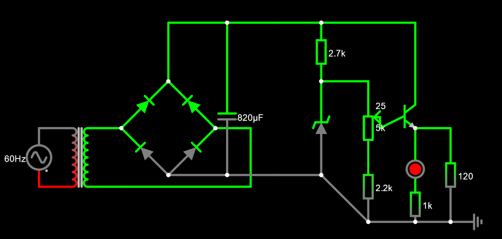
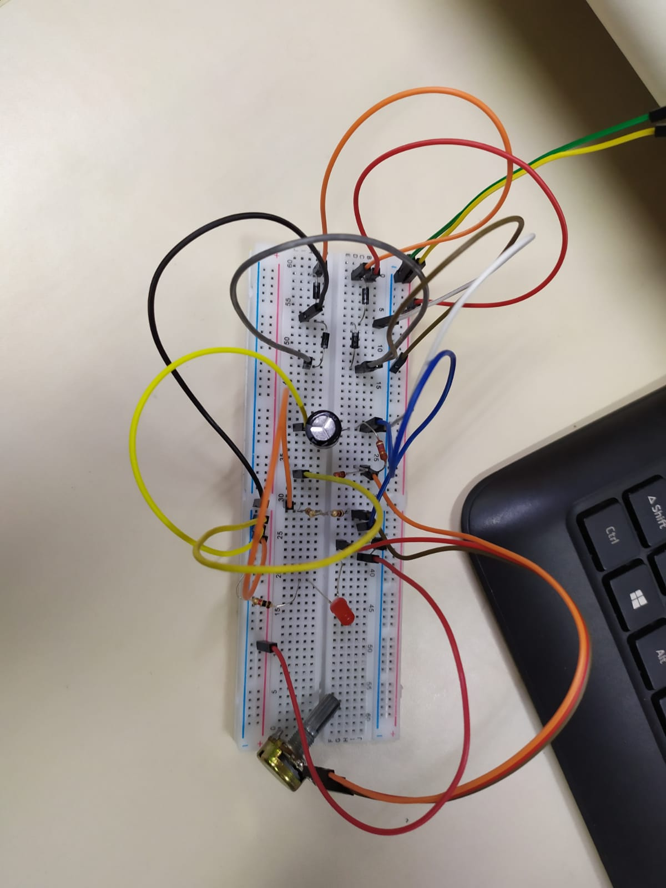
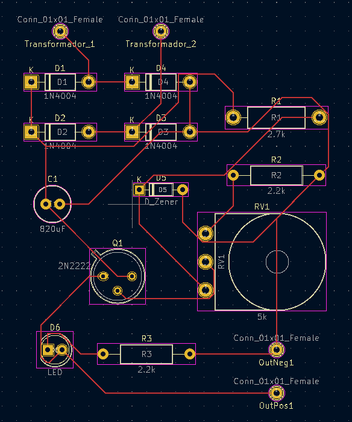
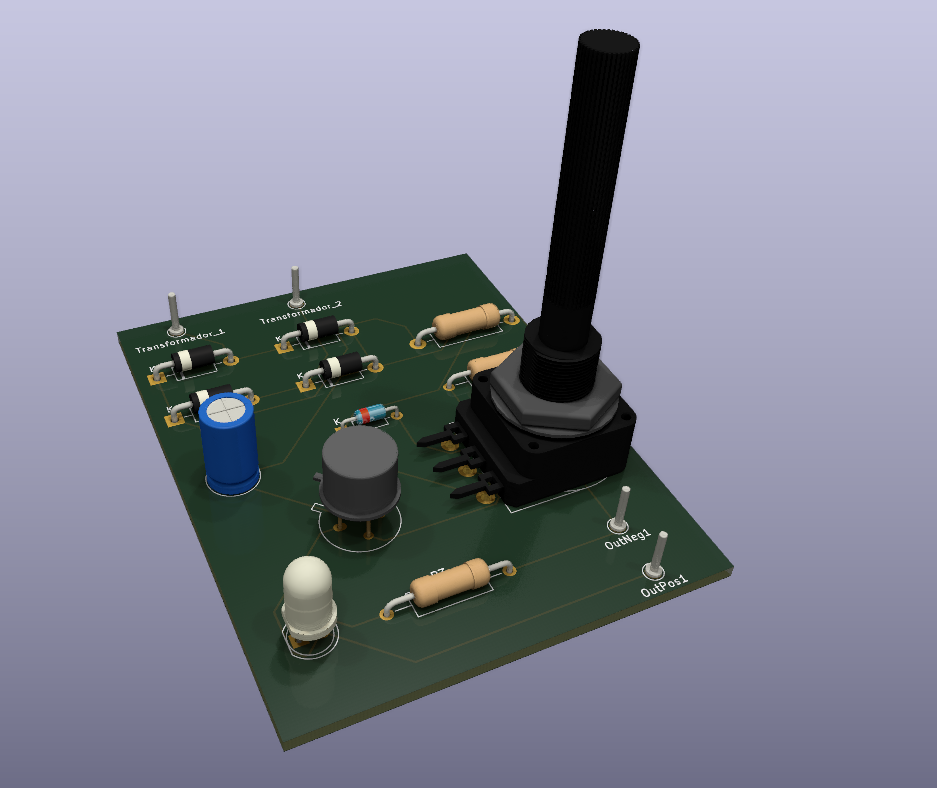
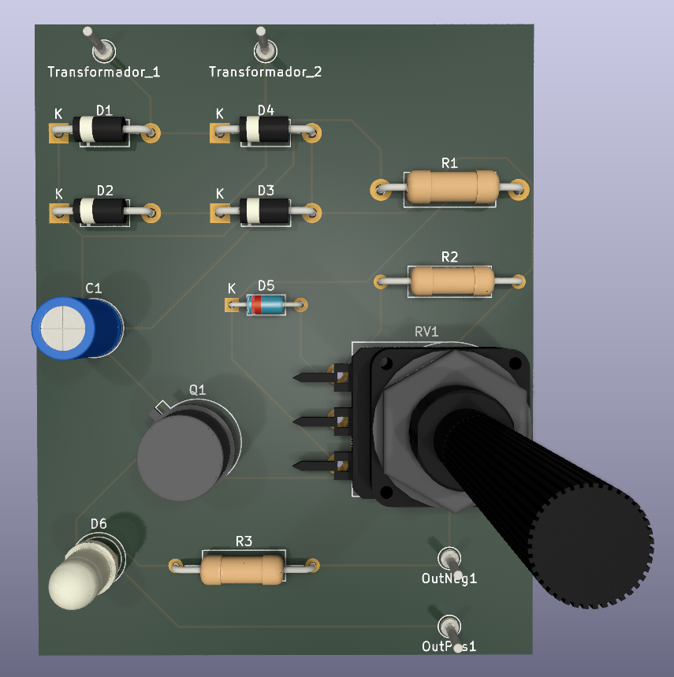

# Carregador
Uma fonte com tensão variável.

## Intruções para o trabalho
O objetivo do trabalho é criar uma fonte que possa carregar um aparelho celular, sendo possível controlar sua saída, a qual varia de 3V até 12V.

## Componentes e preços
Quantidade | Componentes | Preço
---------- | ----------- | -----
1 | Capacitor | Já estava em nossa posse
1 | LED vermelho 5mm | 0,30
1 | Diodo Zenner 13V | 0,25
1 | Transistor NPN | 0,5
1 | Potenciômetro 5K ohms | 2,25
1 | Resistor 1k| 0,05
1 | Resistor 2.7K | 0,05
1 | Resistor 2.2k | 0,05

## Componentes
* Transformador: Reduz a tensão média de 180V para 24V;
* Ponte de diodo: possibilita que a corrente variável da tomada fique contínua;
* Capacitor: armazena e descarrega carga durante o funcionamento do circuito, possibilitando que a corrente seja contínua;
* Diodo Zener: regula a tensão do circuito para que seja 13V;
* Resistores: reduzem tensão, impedindo que o valor da corrente ultrapasse os limites dos componentes do circuito (fazem isso ao dissipar a potência através de calor);
* Potenciometro: componente de resistência variável que permite a variação entre 3V e 12V nas saídas da fonte;
* Transistor: utilizado para amplificar a corrente que passa para as saídas da fonte.

## Cálculos
Por conta da ponte de diodos, a voltagem disponível ao sistema diminui de 24V para algo próximo a 22,6V, pois os diodos em série consomem aproximadamente 1,4V.

Para o cálculo da capacitância mínima que precisamos para alcançar os 10% de ripple usamos a fórmula abaixo:

$$Ripple = \dfrac{Vpico}{2f \times C \times R}$$

Isolando a capacitância:

$$C = \dfrac{Vpico}{Ripple \times 2f \times R}$$

Queremos um ripple de 10%, ou seja, $\dfrac{Ripple}{Vpico} = 0,1$, logo $\dfrac{Vpico}{Ripple} = 10$. A resistência equivalente "R" do sistema é em média 205,94Ω. A frequência inicial era de 60Hz mas por causa da ponte de diodos conseguimos utilizar a corrente que seria "negativa" e efetivamente dobramos a frequência, por isso multiplicamos a frequência "f" por 2 na fórmula.

$$C = \dfrac{10}{120 \times 205,94} \approx 0,00040465$$

Assim, a capacitância mínima necessária é de 404,65µF. No projeto utilizamos um capacitor de 820µF pois o valor encontrado é apenas o mínimo, ficamos então com um ripple mais próximo a 5%.

## Falstad

[Circuito no Falstad](https://tinyurl.com/29td5cmg)

## Imagem da fonte / protoboard

## Imagem da PCB

## Imagens do CAD

